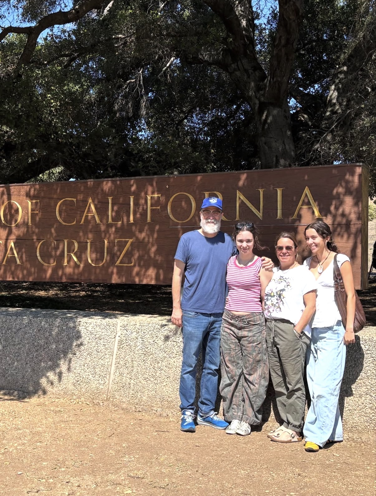
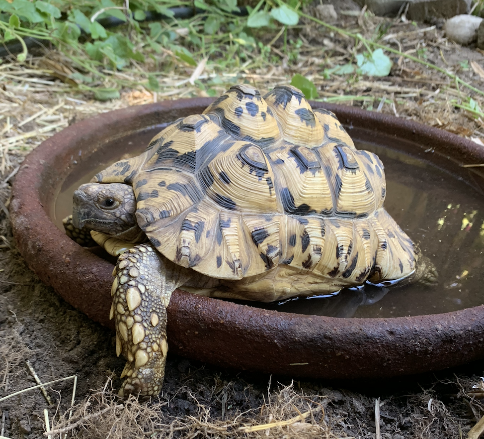
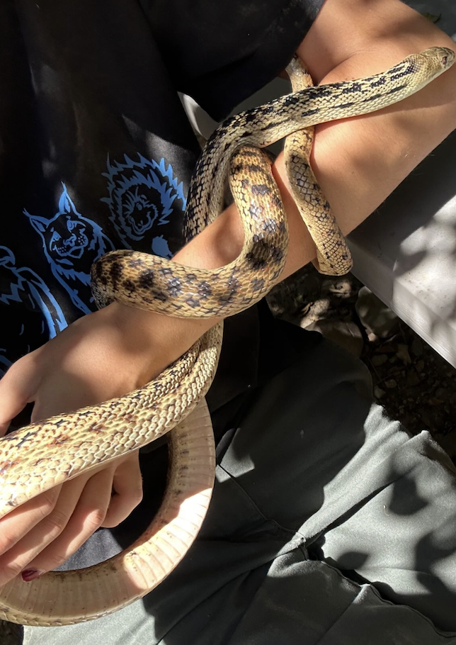
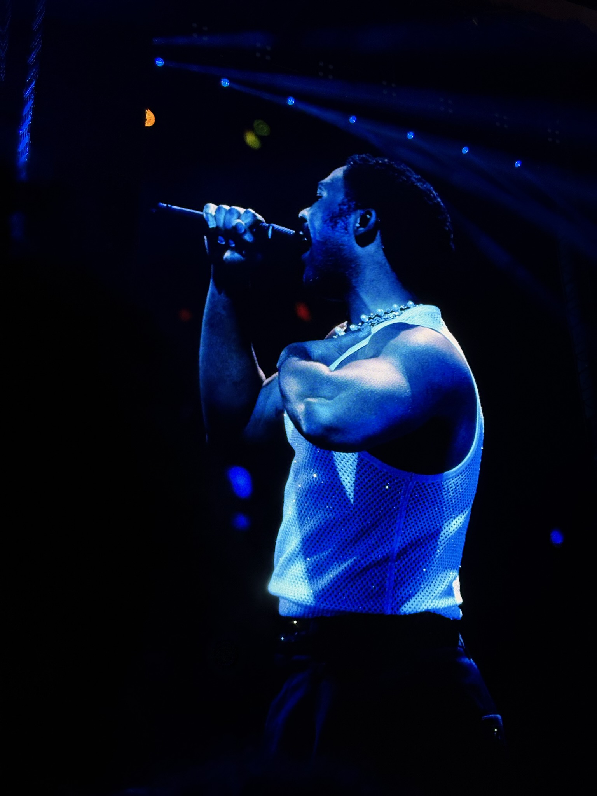

## My pets and family

I am currently living in Isla Vista, CA, but I am from Pasadena (near
Los Angeles), CA along with my family, two dogs and tortoise!

{width="500" height="600"}

{width="250" height="350"}{width="250" height="350"}{width="250" height="350"}

Cleo, Sonny, and Herb (left to right)

## Goals

I am a huge animal lover, and really interested in working with animals
or researching them in the future. I also have a strong interest in
education, and have spent my last three summers working at summer camps,
along with taking classes in outdoor education. Last summer I also
interned at the Wildlife Learning Center, a rescue for animals that are
deemed non-releasable. I loved my experience, and included some of my
favorite "coworkers" below.

Kona- Melanistic Red Fox

{width="250"}

Sweetcheeks- Red Tegu

{width="250"}

Alby- North American Porcupine (seen enjoying some sweet potato)

{width="250"}

Ruger- Giraffe

{width="250"}

Topanga- Gopher snake

{width="250" height="429"}

## Concerts

I love concerts, and I try to go to as many as possible! My favorite is
Camp Flog Gnaw, which is a yearly festival put on by Tyler, the Creator
at Dodger stadium. I have gone for the last three years and plan to be
there again this November. Some pictures from 2025 (of A\$AP Rocky and
Childish Gambino) are below!

{group="cfg" width="500" height="600"} {group="cfg" width="500" height="600"}
