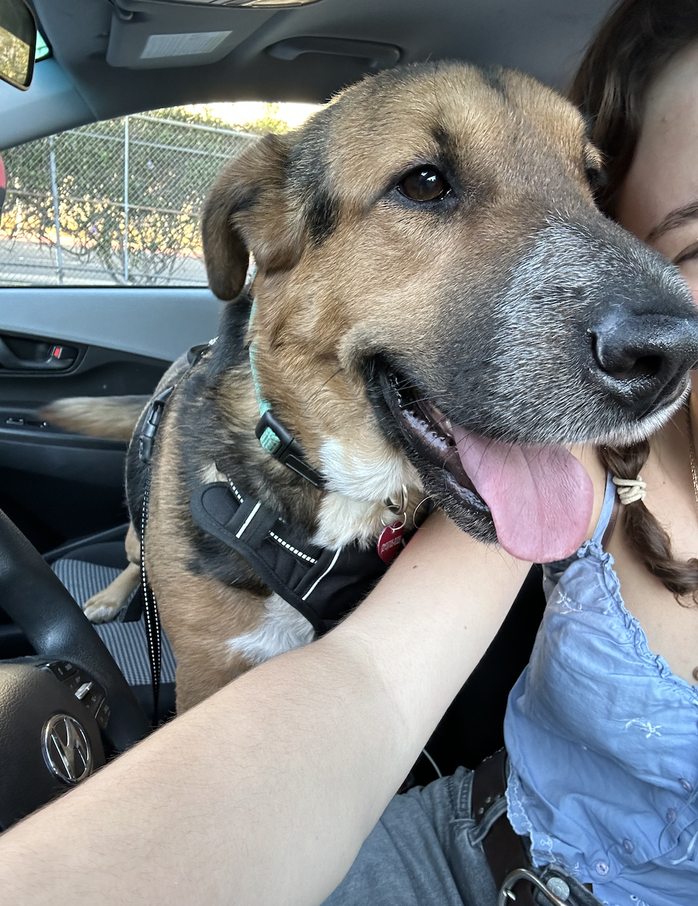
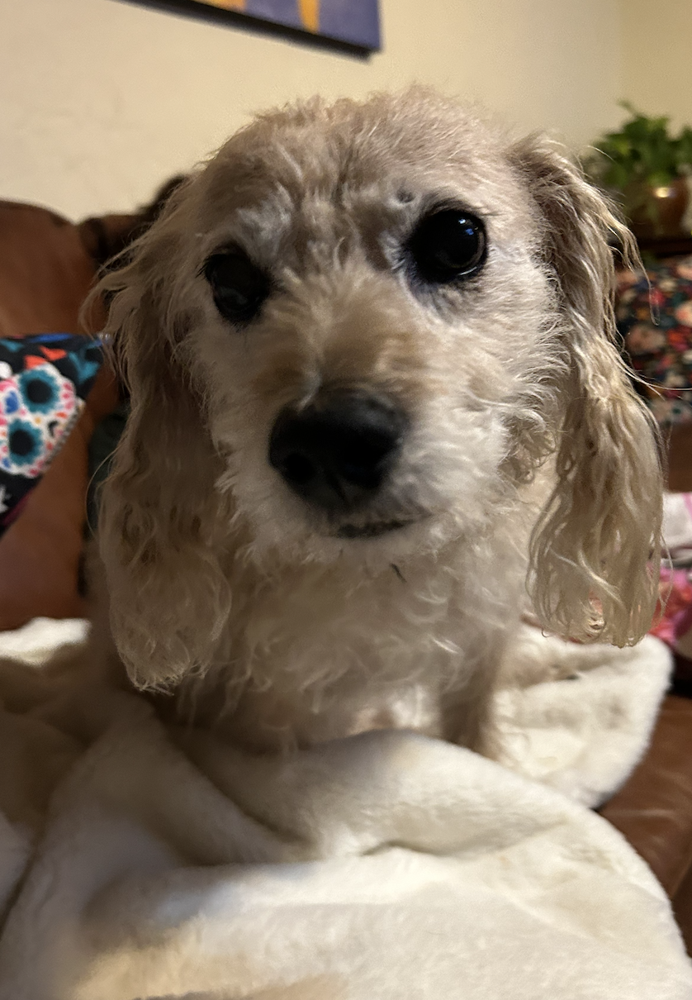
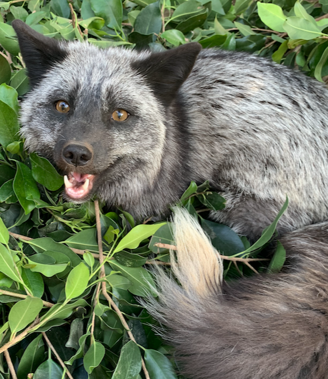
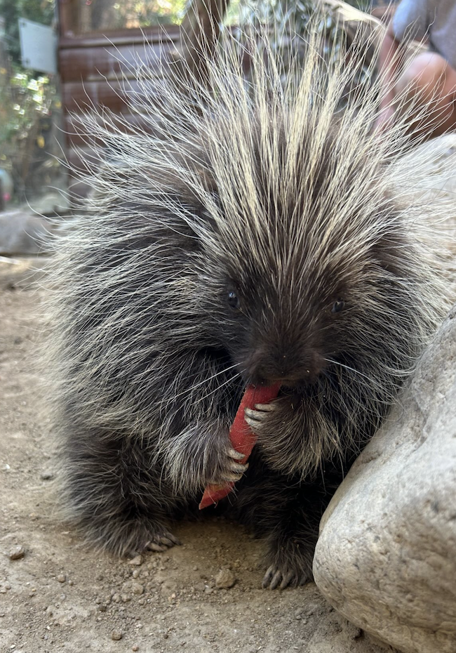
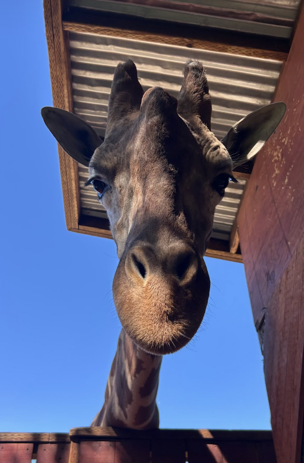

## edit photo sizes?

I am currently living in Isla Vista, CA, but I am from Pasadena (near Los Angeles), CA along with my two dogs and tortoise! 

Cleo

Sonny

Herb

## Goals

I am a huge animal lover, and really interested in working with animals or researching them in the future. I also have a strong interest in education, and have spent my last three summers working at summer camps, along with taking classes in outdoor education. Last summer I also interned at the Wildlife Learning Center, a rescue for animals that are deemed non-releasable. I loved my experience, and included some of my favorite "coworkers" below. 

Kona- Melanistic Red Fox 

Sweetcheeks- Red Tegu 

Alby- North American Porcupine

Ruger- Giraffe

Topanga- Gopher Snake 

