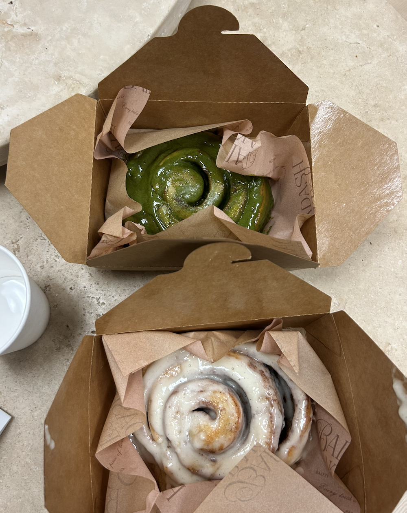
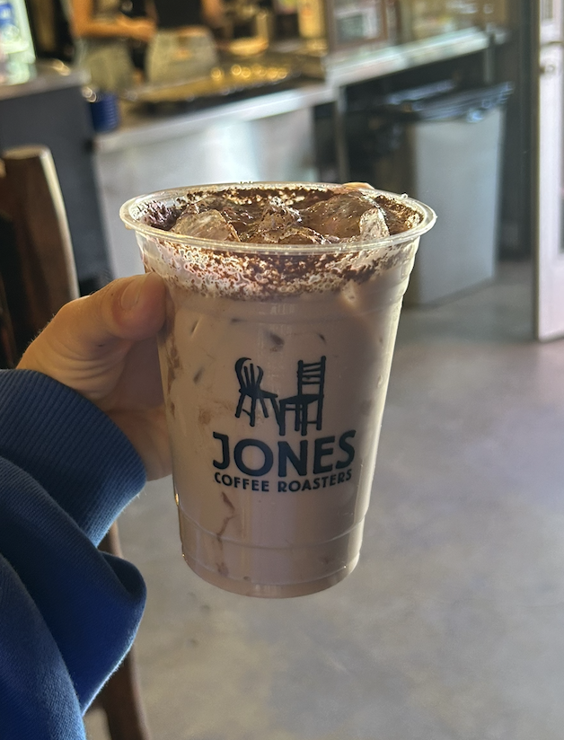
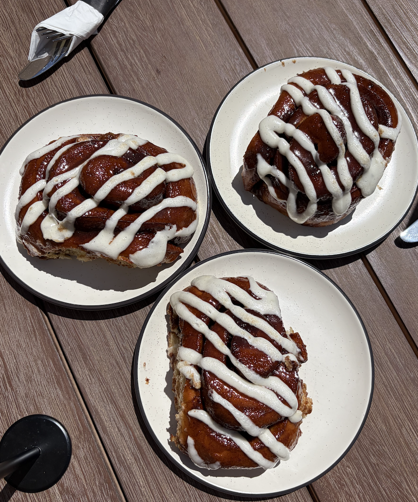
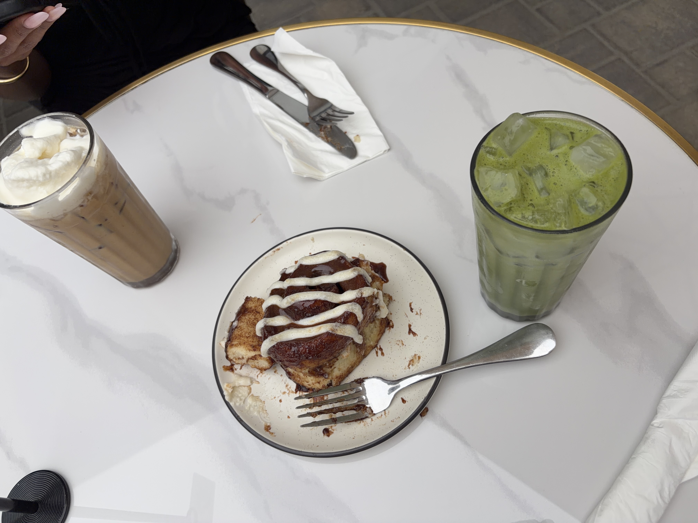
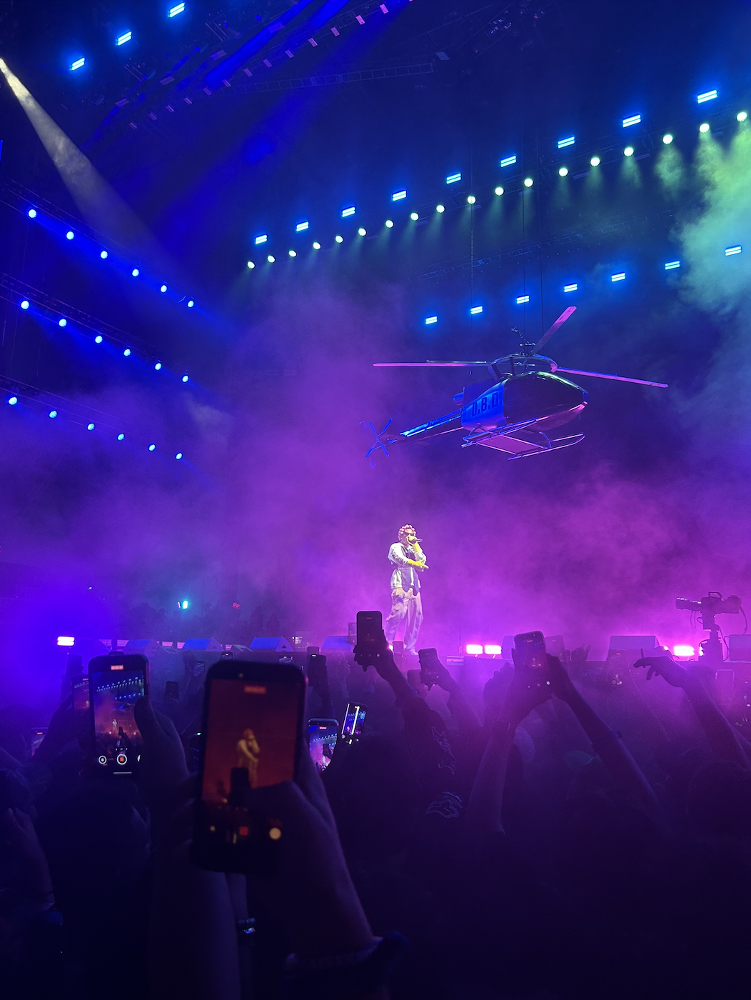

## Rock climbing

I have been rock climbing for about 2 years now, and have found it to be a great way to stay active. I have gone to Joshua Tree the past two winters to climb outdoors.

## Coffee and pastries (my top recommendations)

I have recently been very into cinnamon rolls and I love to go out for coffee or tea in the mornings! Here are my top places at home and at school.

### Pasadena

Badash Bakes- matcha and classic cinnamon rolls 

Jones Coffee- home of my favorite chai latte ever! 

### Santa Barbara

Brass Bird- my current favorite cinnamon roll, accompanied by a cinnamon roll latte and a strawberry matcha latte (all delicious)  

## Concerts

I love concerts, and I try to go to as many as possible! My favorite is Camp Flog Gnaw, which is a yearly festival put on by Tyler, the Creator at Dodger stadium. I have gone for the last three years and plan to be there again this November. Some pictures from 2025 (of A\$AP Rocky and Childish Gambino) are below!

{group="cfg"} {group="cfg"}
